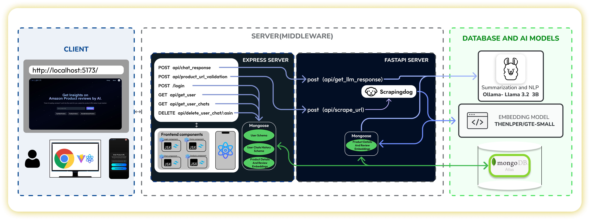

# ReviewBot

**ReviewBot** is an AI-powered product review analysis tool that helps users understand reviews better by integrating a chatbot capable of answering queries about products based on customer feedback. Built using the **MERN** stack (MongoDB, Express, React, Node.js) for web development, and **FastAPI** for handling NLP-based analysis.

---

## Project Overview

This app provides users with insights from product reviews by allowing them to interact with a chatbot. Using sentiment analysis and NLP, the bot helps clarify complex or unclear reviews and suggests whether the product is worth purchasing based on user feedback.

---

## Tech Stack

### Frontend
- **React** for the user interface
- **TailwindCSS** for styling
- **Vite** as the development server

### Backend
- **Node.js**
- **Express** for API framework
- **MongoDB** for database management

### NLP Integration
- **FastAPI** for the Python-based NLP server
- **thenlper/gte-small** for embedding reviews
- **Ollama llama 3.2 3B** for NLP Summarization and Chatbot

---

## Features

- Interactive bot to analyze product reviews.
- Sentiment analysis for providing product review insights.
- User profile management.
- Responsive UI for a smooth user experience.

---

## Project Structure

The ReviewBot project is organized into three main sections:

- **Backend**: Manages core server-side logic and user operations.
- **FastAPI**: Handles NLP tasks like sentiment analysis using pre-trained models.
- **Frontend**: Provides the user interface through a React-based application.

---

## Architecture Diagram




---

## Directory Structure

This directory structure provides an overview of the organization within each section of the project.

### Backend
The backend directory contains the core server-side files for managing user-related operations, database interactions, and API routing. It also includes utility files for token management and other supporting functions. This section uses Node.js and Express for handling API requests.

```plaintext
backend/
├── Controllers/
│   ├── chatControllers.js
│   ├── userControllers.js
├── DB/
│   ├── dbconnection.js
├── models/
│   ├── Chat.js
│   ├── Feedback.js
│   ├── Product.js
│   ├── User.js
├── routes/
│   ├── chatRoutes.js  
│   ├── userRoutes.js
│   ├── index.js
├── utils/
│   ├── Icons.js
│   ├── tokenManager.js
├── .dockerignore
├── Dockerfile
├── .gitignore
├── index.js
├── package-lock.json
├── package.json

```

### FastAPI

The FastAPI directory manages NLP-related tasks using Python. This section processes product reviews to generate insights and responses for user queries. It includes modules for handling NLP models, scraping APIs, and defining schemas and controllers.

```plaintext
fastapi/
├── app/
│   ├── Controllers/
│   │   ├── __init__.py
│   │   ├── routes.py
│   ├── DB/
│   │   ├── __init__.py
│   │   ├── session.py
│   ├── Helpers/
│   │   ├── __init__.py
│   │   ├── embeddingAndFormat.py
│   │   ├── formatter.py
│   │   ├── playwrightScrapper.py
│   │   ├── RagHelper.py
│   │   ├── scrapeAndStore.py
│   │   ├── scraperAPI.py
│   ├── Model/
│   │   ├── __init__.py
│   │   ├── APIModel.py
│   │   ├── embeddingModel.py
│   │   ├── LlamaModel.py
│   │   ├── NLPModel.py       
│   │   ├── SentimentAnalyzer.py
│   ├── Schemas/
│   │   ├── __init__.py
│   │   ├── models.py
│   │   ├── Product.py
│   ├── __init__.py
│   ├── main.py
├── .dockerignore
├── .gitignore
├── Dockerfile
├── requirements.txt


```

### Frontend
The frontend directory is a React-based setup built with Vite. It provides a user-friendly interface that enables users to interact with the chatbot, view review insights, and manage their accounts. This section uses Tailwind CSS for styling.

```plaintext
frontend/
├── public/
├── src/
│   ├── components/
│   │   ├── Common/
│   │   │   ├── Header.jsx
│   │   │   ├── HexagonLoader.jsx
│   │   ├── Sections/
│   │   │   ├── About.jsx
│   │   │   ├── LoginSignUp.jsx
│   │   ├── Views/
│   │       ├── ChatComponent.jsx
│   │       ├── FeatureComingSoon.jsx
│   │       ├── HomeNew.jsx
│   │       ├── NavBar.jsx
│   │       ├── Pricing.jsx
│   │       ├── ProductReview.jsx
│   │       ├── Profile.jsx
│   ├── Context/
│   │   ├── AuthContext.jsx
│   │   ├── User.js
│   ├── Helpers/
│       ├── apiComms.js
│   ├── App.css
│   ├── App.jsx
│   ├── index.css
│   ├── LandingPage.jsx
│   ├── main.jsx
├── tests/
├── .dockerignore
├── .gitignore
├── Dockerfile
├── eslint.config.js
├── index.html
├── package-lock.json
├── package.json
├── playwright.config.ts
├── postcss.config.js
├── README.md
├── tailwind.config.js
├── vite.config.js

```

## Project Modules

### Backend
- **Database (DB)**: Manages connections to the MongoDB database for storing user and chat data.
- **Models**: Defines the database schema for users and chats.
- **Routes**: Contains routing logic for user-related API endpoints.
- **Utils**: Holds utility functions for token management and user controllers.

### FastAPI
- **Controllers**: Defines routes and logic for the FastAPI endpoints.
- **Database (DB)**: Manages database sessions and configurations.
- **Helpers**: Contains utility scripts for formatting and scraping product reviews.
- **Model**: Implements NLP and sentiment analysis models.
- **Schemas**: Defines data schemas for request validation.
- **HuggingFaceModels**: Hosts pre-trained NLP models used for language processing tasks.

### Frontend
- **Components**: Includes reusable UI components and context providers for user authentication.
- **Helpers**: Utility functions for supporting frontend logic.
- **CSS and Styling**: Custom styling files using Tailwind CSS.
- **App**: Main components and entry points for the React application.

---


## Setup and Installation

### Prerequisites

- **Node.js** v14+ for the backend and frontend.
- **Python** 3.8+ for FastAPI.

### Clone the Repository

```bash
git clone https://github.com/Bharadwajreddy1406/ReviewBot.git
cd ReviewBot
```
